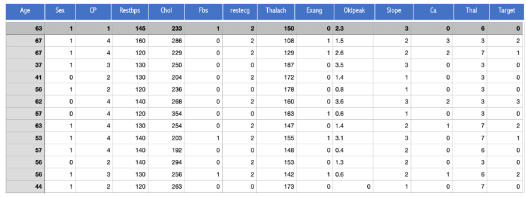
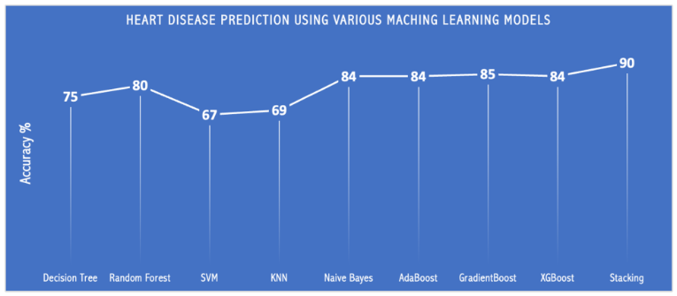

# Introduction 


The Heart Disease Prediction project uses Machine Learning algorithms to analyze medical data and predict a patient's risk of heart disease. Users enter health indicators such as age, blood pressure, cholesterol, heart rate, type of chest pain, etc., and the system returns a prediction result along with the probability of disease.

The project helps illustrate the potential of AI applications in healthcare, supporting screening and early warning for patients, while providing an intuitive interface through Streamlit for easy interaction and use.


# Data

In this project, I will apply basic machine learning methods to predict whether a person is likely to have heart disease based on the Cleveland Heart Disease dataset from the UCI Machine Learning Repository. The Cleveland dataset consists of 14 variables: Age, Gender, Type of Chest Pain, Resting Blood Pressure, Serum Cholesterol, Fasting Blood Glucose, Resting ECG, Maximum Heart Rate, Exercise-Induced Angina, Exercise-Induced ST Depression vs. Res, Peak Exercise-Induced ST Segment, Number of Major Vessels (0–3) Colored with Fluorescence, Thalassemia Display, and Whether There is a Heart Boundary (Heart Disease Diagnosis, 0 indicates the patient does not have the disease and 1,2,3,4 indicates the patient has the disease). The Cleveland dataset consists of 303 samples with 14 pieces of information 



# Model 

Models used in the project: 

- KNN 
- SVM 
- Naive Bayes 
- Decision Tree 
- Random Forest 
- AdaBoost 
- GradientBoost
- XGBoost
- Stacking 




# Installation

To run this project, install the required dependencies listed in requirements.txt:
```bash
pip install -r requirements.txt
```

# Usage

1. Clone the repository: 
```bash
git clone https://github.com/NamNguyenWork27/Heart-Disease-Prediction.git
```

2. Navigate to the project directory:

```bash
cd Heart-Disease-Prediction
```

3. Run on local deployment

```bash
streamlit run app.py
```